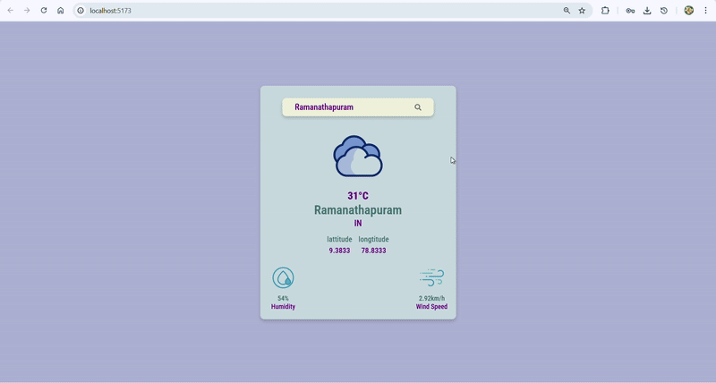

# React Weather App

A Weather App built with **React**.  
It allows users to know about weather of a particular city.

## 🌐 Live Demo
Check out the live version of this project [here](https://react-weather-app-three-fawn.vercel.app/).

## 🚀 Features
- Gives the temperature of the city
- Humidity of the city
- Wind Speed of the city
- Lattitude and Longitude of the city
- Built with **React Hooks**

## 📸 Preview


## 🛠️ Technologies Used
- **React.js**  
- **JavaScript**  
- **HTML5**  
- **CSS3**  
- **Vite**
- **React Icons**
- **OpenWeather API**
- **Postman**
- **Prettier**

## 📦 Installation
```bash
git clone https://github.com/osvi-25/react-weather-app.git
cd react-weather-app
npm install
npm start
```

## 🧑‍💻 Usage
1. **Enter** a city in the input field.  
2. **Click Search Icon** or **Click Enter Button** to know about the weather of the city.
